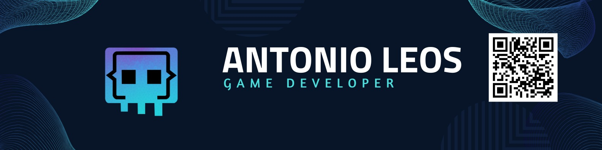

# Antonio Leos
## Indice
- [Inicio](#antonio-leos).
- [Quien soy](#quien-soy).
- [Por que elegí esta carrera](#mi-elección-de-carrera).
- [Que espero trabajar profecionalmente](#que-espero-trabajar).
- [Hobbies](#hobbies).
- [Contacto](#contacto).

---

## Quien soy 

Mi nobre es **Fabián Antonio Leos** y tengo 24 años. Me considero una persona alegre y risueña. Trabajo en una empresa de desarollo de software en el area de soporte tecnico y tambien como programador de el area de VR

---

## Mi elección de carrera
Elegí esta carrera porque desde pequeño me gustan mucho los __videojuegos__ y siempre me han inspirado y me gustaría poder crear o participar en juegos que puedan inspirar a otros.

---

## Que espero trabajar

Espero poder seguir trabajando en la empresa que me encuentro debido a que me está gustando mucho lo que hago y lo que estóy creando

## Hobbies
Mis hobbies son:
- Escuchar musica
- Jugar videojuegos
- Ver series
- Leer

Me gusta invertir mi tiempo en estas actividades porque son un deleite para mi vida y puedo aprender de ellas de una manera u otra.

## Contacto

- [Instagram](https://www.instagram.com/aleos_ziro?igsh=MXV3Z3lvYWZldnBkcw==)

- [WhatsApp](wa.me/5611137793)

